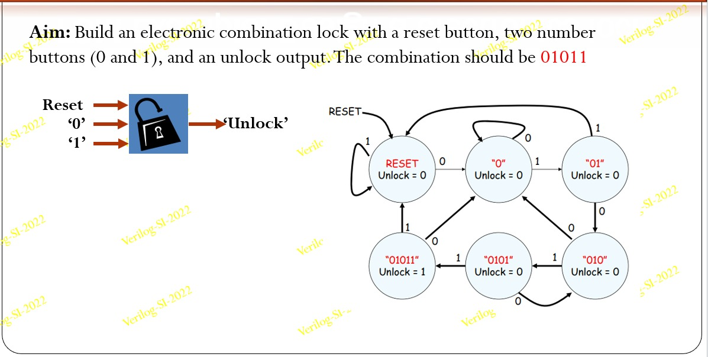
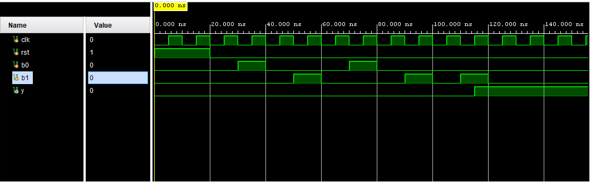

# Combination-Lock-FSM
A Verilog HDL implementation of a Finite State Machine (FSM) sequence detector modeling an electronic combination lock. The module tracks binary inputs from two structural buttons to detect the specific security sequence 01011, triggering an active-high unlock output signal. 
# Electronic Combination Lock FSM

A Mealy/Moore FSM-based electronic combination lock system designed in Verilog HDL. The system processes inputs from two numerical pulse buttons (`0` and `1`) alongside a master reset to track sequence patterns and output an activation lock release signal.

## Project Aim & State Machine Specification

The design unlocks exclusively upon receiving the serial binary code **01011**.

## Repository Structure
- `combination_lock.v`: Synchronous state tracking core mapping state transitions.
- `tb_combination_lock.v`: Testbench driving clock cycles and simulation streams.

## Simulation Verification Result
The behavior waveforms confirm state navigation and highlight the exact cycle where `unlock` triggers to high output upon the validation of the sequential data packets.

